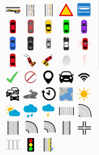
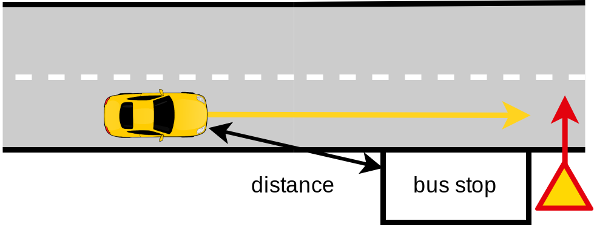
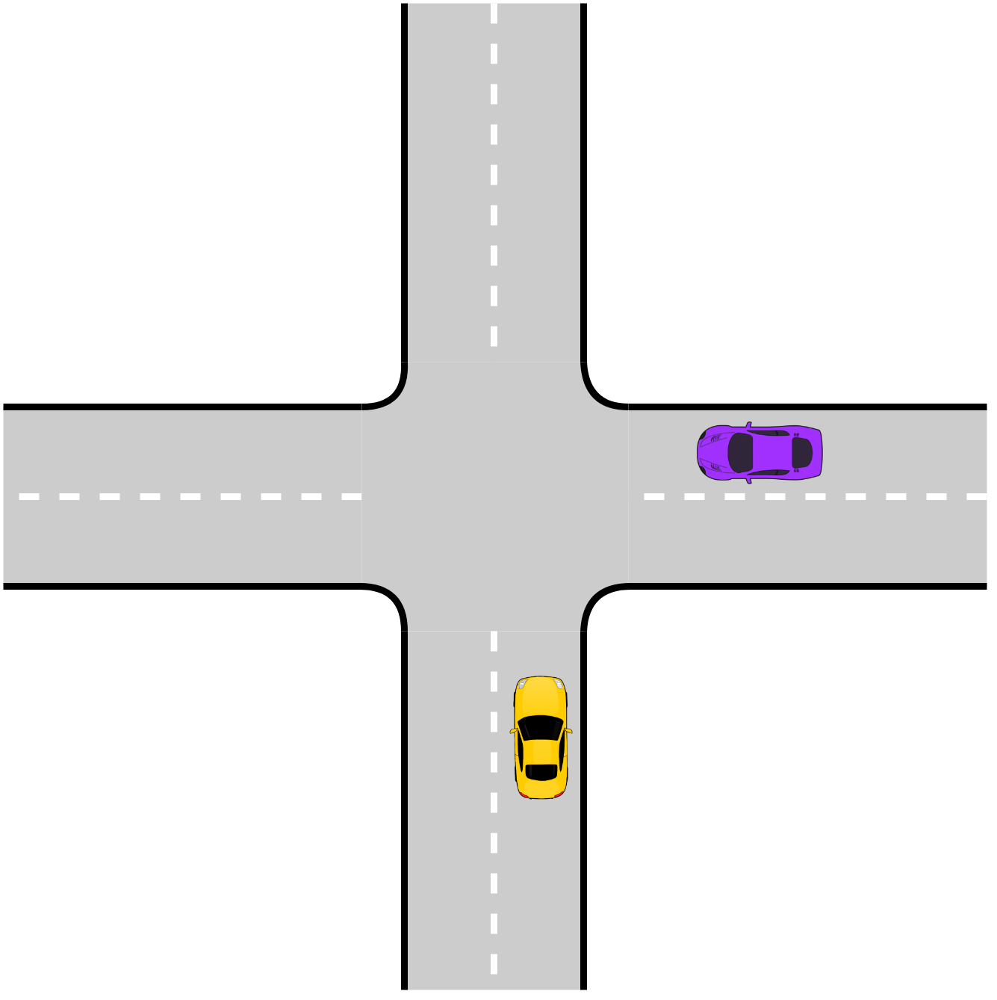
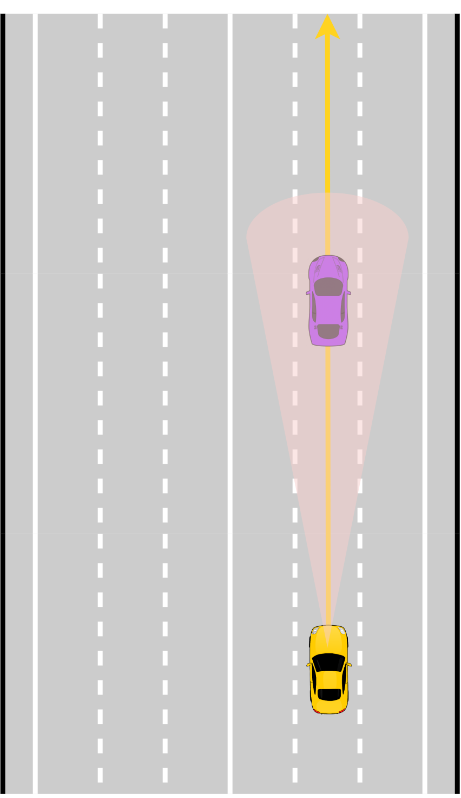
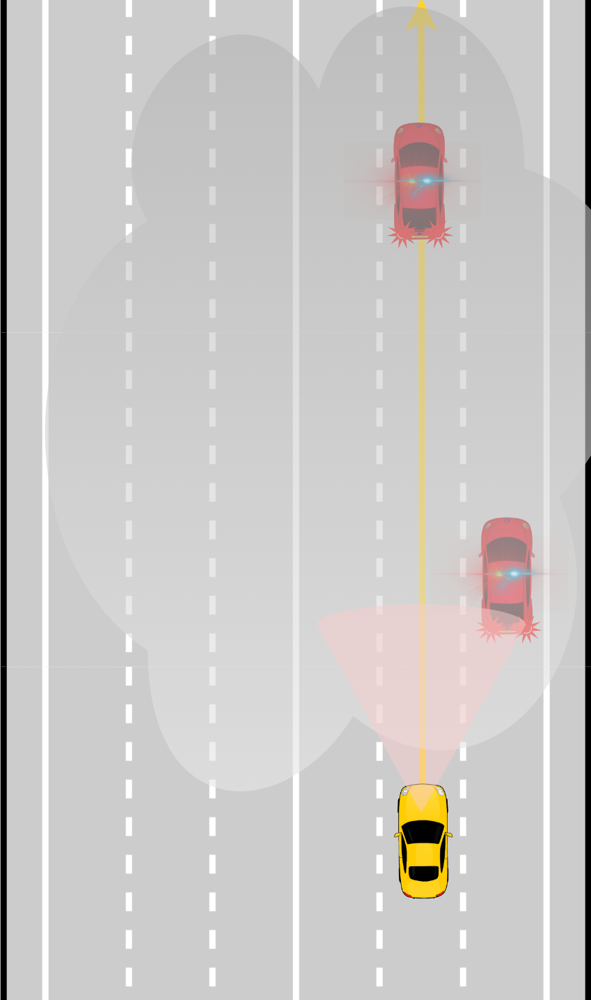

# Drawio IV scenario custom library

Custom Drawio library to create intelligent vehicule scenarios.

## Usage

Import the custom library into Drawio.
See <https://www.drawio.com/blog/custom-libraries>.

## Examples

|  |  |
|:---------------------------------------------:|:----------------------------------------------:|
| Bus‑stop scenario                              | Intersection scenario                           |
|  |  |
| Adaptive cruise control                        | Emergency vehicles (low visibility)             |
